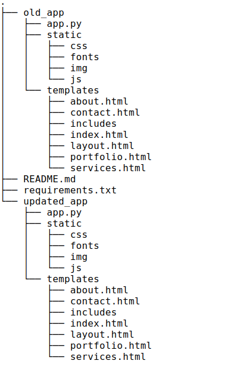

## Building Secured Flask Apps

### Summary
In this talk, we will discuss essential security considerations you must follow to create a secured Flask app.

### Description
This repo has the codes for my talk on [Building Secured Flask Apps](https://flaskcon.com).

#### Tools used:
- Google Chrome browser's DevTools.
- WebPage Test (optional)

#### Other further improvements:
- Using a CDN (Content Delivery Network)
- Using a reverse proxy like Nginx to intercept requests between client and server
- Implementing HTTPS on your server if you haven’t

### Project Tree

**AUTHOR**: Duodu Randy

Date: 1st December, 2021
